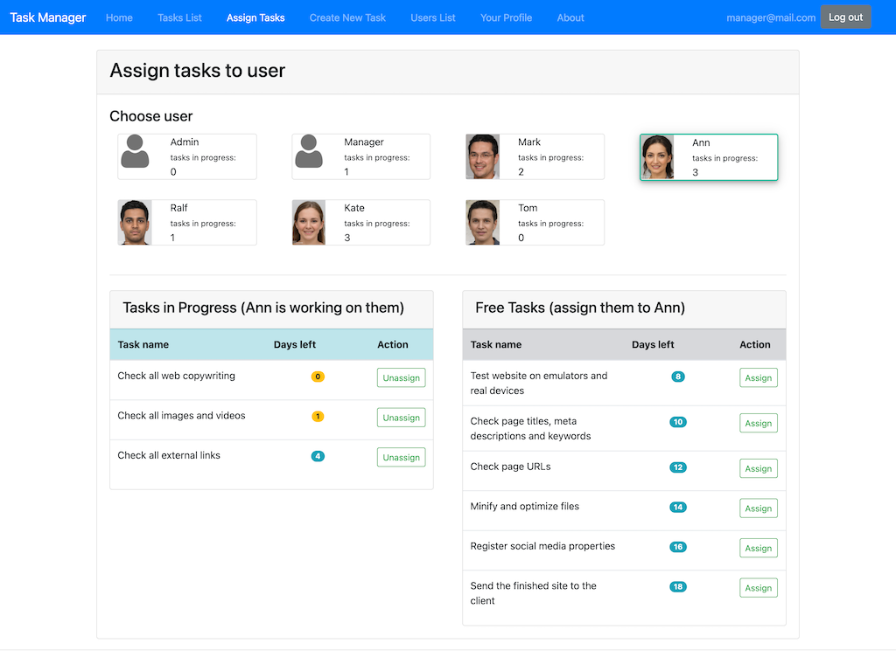

# タスク管理アプリ
チームでのタスク管理ができるアプリ



## 特徴
各ユーザーは以下の操作が可能

**管理者:**
-   タスクの作成、ユーザーへのタスクの割り当て
-   ユーザー一覧の閲覧、ユーザーの削除
-   タスク一覧の閲覧、タスクの編集・削除
-   タスクの完了・未完了の切り替え
-   プロフィールページの閲覧

**一般ユーザー:**
-   タスクの作成
-   ユーザー一覧の閲覧
-   タスク一覧の閲覧、担当しているタスクの編集・削除
-   担当しているタスクの完了・未完了の切り替え
-   プロフィールページの閲覧

## 開発環境
* Java 8（jdk1.8.0_171）
* Spring Boot 2.4.3
* MySQL 8.0.25
* Maven 3.6.3
* Bootstrap 4.2.1
* jQuery 3.3.1-1
* Docker 20.10.6
* Docker Compose 1.29.1

## アプリ実行方法
プロジェクトをビルド（プロファイルを指定）

```
mvn clean install -Dspring.profiles.active=dev -DskipTests
```

Docker Composeを使用してアプリを実行（プロファイルを指定）

```
docker-compose -f docker-compose.yml -f docker-compose.dev.yml up --build
```


コンテナ上でアプリ起動後、ブラウザで[http://localhost:8080](http://localhost:8080)を開く。<br/>
ログインするには、下記のEmail、Passwordを使用するか、もしくはログイン画面下のデモユーザーボタンを押下する。

Email             | Password
----------------- | -------------
manager@mail.com  | 112233
ann@mail.com      | 112233
mark@mail.com     | 112233

コンテナを停止する場合、`docker-compose down`を使用する

```
docker-compose down
```
